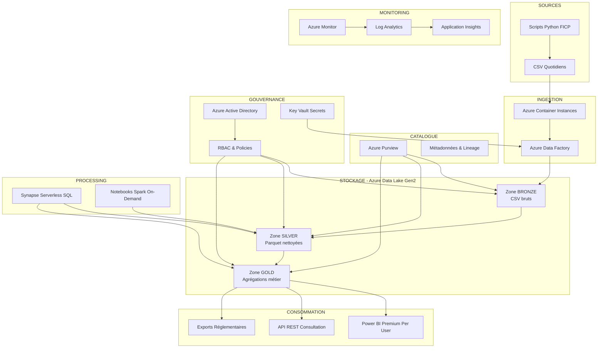

# 🏗️ Architecture Data Lake FICP - Certification Data Engineer

## 📊 Contexte du projet
- **Objectif** : Certification Data Engineer (Compétences C18-C21)
- **Données** : FICP fictives (consultations, courriers, radiations)
- **Volumétrie** : 200-300 clients/jour, 1 an d'historique
- **Budget** : 10-15€/mois (crédits Azure étudiant)
- **Région** : France Central

## 🎯 Architecture optimisée coûts/performance



## 💰 Estimation des coûts (par mois)

| Service | Configuration | Coût estimé |
|---------|---------------|-------------|
| **Data Lake Storage Gen2** | Standard LRS, 50GB | ~1€ |
| **Data Factory** | 10 pipelines/jour, minimal | ~2€ |
| **Synapse Serverless SQL** | Queries on-demand | ~1-2€ |
| **Azure Purview** | Compte standard | ~3€ |
| **Container Instances** | 2 vCPU, 1h/jour | ~1€ |
| **Power BI Pro** | 1 utilisateur | ~8€ |
| **Monitoring & Divers** | Logs, métriques | ~1€ |
| **TOTAL** | | **~17€** |

## 🎯 Optimisations coûts
- **Pas de Synapse Pools dédiés** → Serverless uniquement
- **Container Instances** au lieu de VMs permanentes
- **Storage Standard** au lieu de Premium
- **Purview minimal** (1 compte seulement)
- **Power BI Pro** au lieu de Premium

## 🔧 Services Azure sélectionnés

### **Stockage : Azure Data Lake Storage Gen2**
- **Zone BRONZE** : `/raw/ficp/{year}/{month}/{day}/`
- **Zone SILVER** : `/processed/ficp/{table}/{year}/{month}/`
- **Zone GOLD** : `/analytics/ficp/{view}/{year}/`
- **Partitioning** : Par date pour optimiser les coûts de requête

### **Ingestion : Azure Data Factory**
- **Pipeline quotidien** : Déclenchement 6h00 chaque matin
- **Container Instance** : Exécution scripts Python
- **Copy Activity** : Transfer CSV vers BRONZE
- **Data Flow** : Transformation CSV → Parquet (SILVER)

### **Processing : Azure Synapse Serverless**
- **SQL On-Demand** : Requêtes sur Parquet
- **Spark Notebooks** : Transformations complexes (à la demande)
- **External Tables** : Exposition données comme vues SQL

### **Catalogue : Azure Purview**
- **Scan automatique** ADLS Gen2
- **Classifications** : "Données FICP", "Données Bancaires"
- **Lineage** : Traçabilité transformations
- **Glossaire métier** : Terminologie FICP

### **Gouvernance : Azure AD + Policies**
- **Groupes de sécurité** :
  - `FICP-DataEngineers` : Accès complet
  - `FICP-Analysts` : Silver/Gold lecture
  - `FICP-Viewers` : Gold lecture seule
- **RBAC** : Permissions granulaires par zone
- **Policies** : Rétention 5 ans, chiffrement obligatoire

### **Consommation : Power BI + API**
- **Dashboard réglementaire** : 
  - Volume consultations par agence
  - Suivi inscriptions/radiations
  - Alertes conformité
- **API de recherche** : 
  - Recherche par n° dossier client
  - Statut FICP (inscrit/radié/clean)
  - Historique consultations

## 🎯 Cas d'usage métier prioritaires

### **1. Recherche par numéro de dossier**
```sql
-- API REST endpoint : /api/ficp/search/{numero_dossier}
SELECT 
    c.id_client,
    c.date_consultation,
    i.date_inscription,
    r.date_radiation,
    CASE 
        WHEN r.date_radiation IS NOT NULL THEN 'RADIÉ'
        WHEN i.date_inscription IS NOT NULL THEN 'INSCRIT' 
        ELSE 'NON INSCRIT'
    END as statut_ficp
FROM consultations c
LEFT JOIN inscriptions i ON c.id_client = i.id_client
LEFT JOIN radiations r ON c.id_client = r.id_client
WHERE c.id_client = '{numero_dossier}'
```

### **2. Conformité réglementaire**
- **Traçabilité** : Qui a consulté quoi et quand
- **Audit trail** : Log de tous les accès
- **Reporting ACPR** : Export mensuel automatique

### **3. Dashboard Power BI**
- **KPIs temps réel** : Consultations du jour
- **Tendances** : Évolution inscriptions/radiations
- **Alertes** : Volumes anormaux, erreurs système

## 📋 Livrables de certification

### **Critère C18 - Architecture**
✅ **Schéma technique** avec justifications 3V  
✅ **Comparatif catalogues** (Purview vs concurrents)  
✅ **Dimensionnement** basé sur volumétrie réelle  

### **Critère C19 - Infrastructure**
✅ **Scripts Bicep** pour déploiement automatique  
✅ **Documentation** installation pas-à-pas  
✅ **Environnements** Test + Prod fonctionnels  

### **Critère C20 - Catalogue RGPD**
✅ **Purview configuré** avec classifications  
✅ **Politiques RGPD** spécifiques FICP  
✅ **Monitoring** performances et alertes  

### **Critère C21 - Gouvernance**
✅ **RBAC granulaire** par groupes Azure AD  
✅ **Documentation** procédures d'accès  
✅ **Conformité** réglementaire bancaire  

## 🚀 Planning de déploiement

| Phase | Durée | Livrables |
|-------|-------|-----------|
| **Design** | 1 jour | Architecture + Comparatifs |
| **Infrastructure** | 2 jours | Bicep + Déploiement |
| **Pipelines** | 2 jours | Data Factory + Transformations |
| **Catalogue** | 1 jour | Purview + Métadonnées |
| **Gouvernance** | 1 jour | RBAC + Politiques |
| **Power BI** | 1 jour | Dashboard + API |
| **Documentation** | 1 jour | Guides + Validation |

**Total : 9 jours** pour un Data Lake production-ready !