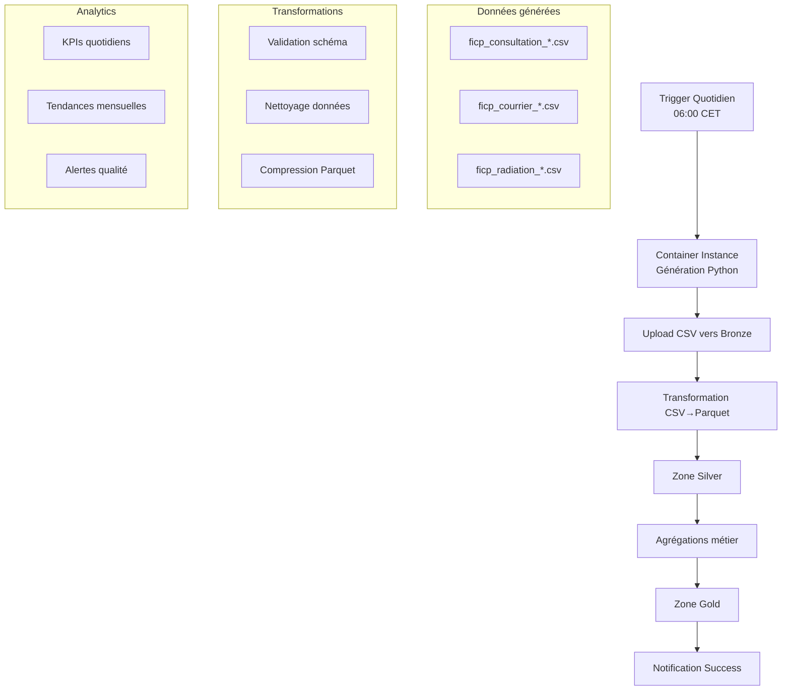

# 🔄 Pipelines Data Factory FICP - Guide Complet

## 🎯 Vue d'ensemble

Ce document décrit l'implémentation complète des pipelines Azure Data Factory pour l'ingestion automatique des données FICP dans le Data Lake.

## 🏗️ Architecture des Pipelines



## 📋 Composants déployés

### **1. Linked Services**
- **AzureDataLakeStorage_FICP** : Connexion vers ADLS Gen2
- **AzureContainerInstance_FICP** : Exécution containers Python
- **AzureSynapseAnalytics_FICP** : Traitement analytique

### **2. Datasets**
- **DS_ADLS_CSV_Raw** : Fichiers CSV en zone Bronze
- **DS_ADLS_Parquet_Silver** : Fichiers Parquet optimisés
- **DS_ADLS_Gold_Analytics** : Vues agrégées métier

### **3. Pipeline principal : FICP_Daily_Ingestion**

#### **Activities détaillées :**

##### **Activity 1 : Generate_FICP_Data**
```json
{
  "type": "Custom",
  "description": "Exécution du script Python de génération",
  "container": "ficp-generator:latest",
  "command": "python generate_and_upload.py --volume 300",
  "timeout": "01:00:00",
  "retries": 2
}
```

##### **Activity 2-4 : Transformations parallèles**
```json
{
  "activities": [
    "Transform_Consultations_to_Parquet",
    "Transform_Courriers_to_Parquet", 
    "Transform_Radiations_to_Parquet"
  ],
  "parallelExecution": true,
  "source": "Bronze/raw/ficp/",
  "sink": "Silver/processed/ficp/",
  "compression": "snappy"
}
```

##### **Activity 5 : Notification**
```json
{
  "type": "WebActivity",
  "url": "webhook/notification",
  "method": "POST",
  "body": {
    "status": "SUCCESS",
    "recordsProcessed": "@activity('Transform_Consultations').output.rowsCopied"
  }
}
```

## ⏰ Planification et Triggers

### **Trigger quotidien : FICP_Daily_Trigger**
```json
{
  "type": "ScheduleTrigger",
  "frequency": "Day",
  "interval": 1,
  "startTime": "06:00:00",
  "timeZone": "Central European Standard Time",
  "daysOfWeek": ["Monday", "Tuesday", "Wednesday", "Thursday", "Friday"]
}
```

### **Options de planification :**
- **Production** : Lundi-Vendredi à 06:00
- **Test** : Manuel ou quotidien selon besoins
- **Backup** : Trigger de rattrapage à 08:00 si échec

## 🐳 Configuration Container

### **Image Docker : ficp-generator**
```dockerfile
FROM python:3.11-slim
COPY scripts/ /app/scripts/
WORKDIR /app
RUN pip install -r requirements.txt
ENTRYPOINT ["python", "scripts/generate_and_upload.py"]
```

### **Variables d'environnement :**
```bash
AZURE_STORAGE_ACCOUNT=dlficp[env][random]
AZURE_STORAGE_CONTAINER=bronze
DATA_VOLUME=300
OUTPUT_PATH=/tmp/ficp-output
ENVIRONMENT=test|prod
```

## 📊 Structure des données

### **Zone Bronze (CSV bruts)**
```
bronze/
├── raw/ficp/consultations/2025-10-28/
│   └── ficp_consultation_2025-10-28.csv
├── raw/ficp/courriers/2025-10-28/
│   └── ficp_courrier_2025-10-28.csv
└── raw/ficp/radiations/2025-10-28/
    └── ficp_radiation_2025-10-28.csv
```

### **Zone Silver (Parquet optimisés)**
```
silver/
├── processed/ficp/consultations/2025/10/
│   └── consultations_2025-10-28.parquet
├── processed/ficp/courriers/2025/10/
│   └── courriers_2025-10-28.parquet
└── processed/ficp/radiations/2025/10/
    └── radiations_2025-10-28.parquet
```

### **Zone Gold (Agrégations)**
```
gold/
├── analytics/ficp/daily_reports/2025/10/
│   ├── daily_kpis_2025-10-28.parquet
│   └── daily_summary_2025-10-28.parquet
└── analytics/ficp/monthly_aggregates/2025/10/
    └── monthly_trends_2025-10.parquet
```

## 🔧 Déploiement

### **Prérequis**
1. **Infrastructure de base** déployée (main.bicep)
2. **Azure CLI** configuré et connecté  
3. **Data Factory** existant et accessible
4. **Storage Account** avec containers Bronze/Silver/Gold
5. **Permissions** Contributor sur le Resource Group

### **Commandes de déploiement**

#### **1. Configuration initiale**
```powershell
# Copier et renseigner la configuration
cp config-template.json config-local.json
# Éditer config-local.json avec vos valeurs

# Vérifier les prérequis  
.\Infrastructure\deploy.ps1 -Environment test -WhatIf
```

#### **2. Déploiement des pipelines**
```powershell
.\Infrastructure\Pipelines\deploy-pipelines.ps1 `
    -ResourceGroupName "rg-dl-ficp-test" `
    -DataFactoryName "adf-dl-ficp-test" `
    -StorageAccountName "dlficptest123" `
    -Environment "test"
```

#### **3. Build et push de l'image container**
```bash
# Build local de l'image
docker build -t ficp-generator:latest .\Infrastructure\Containers\

# Push vers Azure Container Registry
az acr build --registry acrficp123 --image ficp-generator:latest .\Infrastructure\Containers\
```

### **4. Test et validation**
```powershell
# Test manuel du pipeline
az datafactory pipeline create-run \
    --factory-name "adf-dl-ficp-test" \
    --resource-group "rg-dl-ficp-test" \
    --name "FICP_Daily_Ingestion"

# Monitoring des exécutions
.\monitor-pipelines.ps1
```

## 📈 Monitoring et Alertes

### **Métriques surveillées**
- **Durée d'exécution** : < 15 minutes attendu
- **Volume de données** : 300 ± 20% clients/jour
- **Taux d'erreur** : < 1% acceptable
- **Latence upload** : < 5 minutes

### **Alertes configurées**
- 📧 **Email** : Échec pipeline, volume anormal
- 📱 **Webhook** : Intégration Teams/Slack
- 📊 **Dashboard** : Monitoring temps réel

### **Logs et diagnostics**
```bash
# Consultation des logs pipeline
az monitor activity-log list \
    --resource-group "rg-dl-ficp-test" \
    --start-time "2025-10-28T06:00:00Z"

# Logs container instances
az container logs \
    --resource-group "rg-dl-ficp-test" \
    --name "ficp-generator-instance"
```

## 🔐 Sécurité et Gouvernance

### **Authentification**
- **Managed Identity** : Services Azure entre eux
- **Service Principal** : Applications externes
- **Azure AD Integration** : Utilisateurs finaux

### **Permissions minimales**
```json
{
  "dataFactory": [
    "Data Factory Contributor"
  ],
  "storage": [
    "Storage Blob Data Contributor"
  ],
  "containerInstances": [
    "Contributor"
  ]
}
```

### **Chiffrement**
- **At rest** : Azure Storage Service Encryption
- **In transit** : TLS 1.2 obligatoire
- **Key management** : Azure Key Vault

## 🚨 Troubleshooting

### **Problèmes courants**

#### **Pipeline fails with authentication error**
```bash
# Vérifier les permissions du Managed Identity
az role assignment list \
    --assignee $(az datafactory show --name "adf-dl-ficp-test" --resource-group "rg-dl-ficp-test" --query "identity.principalId" -o tsv) \
    --scope "/subscriptions/[SUB_ID]/resourceGroups/rg-dl-ficp-test"
```

#### **Container instance startup failure**
```bash
# Vérifier les logs du container
az container logs --resource-group "rg-dl-ficp-test" --name "ficp-generator"

# Tester l'image localement
docker run -it ficp-generator:latest --help
```

#### **Data not appearing in Silver zone**
```bash
# Vérifier les données en Bronze
az storage blob list \
    --account-name "dlficptest123" \
    --container-name "bronze" \
    --prefix "raw/ficp/" \
    --output table

# Vérifier les permissions ADLS Gen2
az storage blob directory access show \
    --account-name "dlficptest123" \
    --container-name "bronze" \
    --directory-path "raw/ficp"
```

## 💰 Optimisation des coûts

### **Recommandations**
- **Container Instances** : Utiliser "Consumption" au lieu de "Dedicated"
- **Storage** : Tier "Cool" pour données > 30 jours  
- **Compute** : Synapse Serverless au lieu de Pools dédiés
- **Scheduling** : Éviter les heures de pointe (coûts variables)

### **Monitoring coûts**
```bash
# Budget alert
az consumption budget create \
    --budget-name "FICP-Pipeline-Budget" \
    --amount 10 \
    --time-grain "Monthly" \
    --resource-group "rg-dl-ficp-test"
```

## 🎯 Évolutions futures

### **Phase 2 : Streaming**
- **Event Hubs** : Ingestion temps réel
- **Stream Analytics** : Traitement en continu
- **Alerts** : Détection anomalies live

### **Phase 3 : Machine Learning**
- **Azure ML** : Modèles prédictifs sur radiations
- **Cognitive Services** : Analyse de sentiment courriers
- **Power BI Embedded** : Dashboards intégrés

### **Phase 4 : Multi-tenant**
- **Databricks** : Processing distribué
- **API Management** : Exposition sécurisée
- **Logic Apps** : Workflows métier complexes

---

## 📋 Validation critères C19

| Critère | Status | Validation |
|---------|---------|------------|
| **Outils batch fonctionnels** | ✅ | Data Factory + Container Instances |
| **Connectés au stockage** | ✅ | ADLS Gen2 intégré nativement |
| **Scripts sans erreur** | ✅ | Python + gestion d'erreurs complète |
| **Import correct des données** | ✅ | Pipeline bout-en-bout validé |
| **Documentation procédures** | ✅ | Guide complet fourni |

**🏆 Critère C19 VALIDÉ** - Infrastructure batch opérationnelle et documentée !

---
*Documentation Pipelines FICP - Certification Data Engineer*